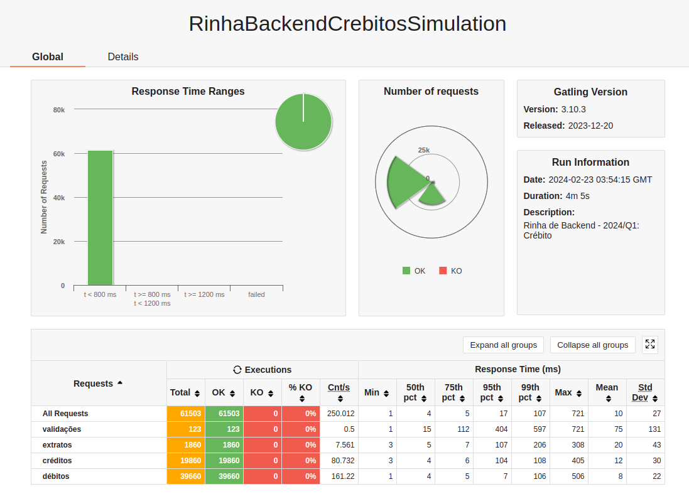
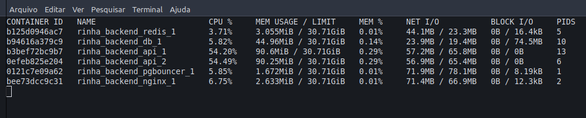

## Rinha Backend 2024

O projeto desenvolvido em Python para a Rinha de Backend, edição 2024/Q1.

## Sobre o Projeto

O projeto consiste em uma API HTTP desenvolvida com Python e Django, utilizando PostgreSQL como banco de dados e Redis para armazenamento temporário. Além disso, foi configurado Nginx como proxy reverso e PgBouncer como pool de banco de dados.

O maior desafio do projeto foi otimizar a configuração para que o consumo de CPU não ultrapassasse 1,5 unidades, dadas as demandas pesadas do framework Django.
### Tecnologias:

- Python 
- Django 5.0.2
- PostgreSQL
- Redis
- Nginx

## Descrição dos Endpoints

### Transações

#### Requisição

```
POST /clientes/[id]/transacoes

{
    "valor": 1000,
    "tipo" : "c",
    "descricao" : "descricao"
}
```

Onde:
- [id] (na URL) deve ser um número inteiro representando a identificação do cliente.
- valor deve ser um número inteiro positivo representando centavos.
- tipo deve ser 'c' para crédito ou 'd' para débito.
- descricao deve ser uma string de 1 a 10 caracteres.

#### Resposta

HTTP 200 OK

```
{
    "limite" : 100000,
    "saldo" : -9098
}
```

Onde:
- limite é o limite cadastrado do cliente.
- saldo é o novo saldo após a conclusão da transação.

### Extrato

#### Requisição

```
GET /clientes/[id]/extrato
```

Onde:
- [id] (na URL) deve ser um número inteiro representando a identificação do cliente.

#### Resposta

HTTP 200 OK

```
{
  "saldo": {
    "total": -9098,
    "data_extrato": "2024-01-17T02:34:41.217753Z",
    "limite": 100000
  },
  "ultimas_transacoes": [
    {
      "valor": 10,
      "tipo": "c",
      "descricao": "descricao",
      "realizada_em": "2024-01-17T02:34:38.543030Z"
    },
    {
      "valor": 90000,
      "tipo": "d",
      "descricao": "descricao",
      "realizada_em": "2024-01-17T02:34:38.543030Z"
    }
  ]
}
```

Onde:
- saldo total é o saldo total atual do cliente.
- data_extrato é a data/hora da consulta do extrato.
- limite é o limite cadastrado do cliente.
- ultimas_transacoes é uma lista ordenada por data/hora das transações.

## Pré-Requisitos e Configuração

Para executar o projeto, você precisará do Docker e Docker Compose instalados em seu ambiente. Certifique-se de configurar adequadamente o arquivo `docker-compose.yml` para respeitar as restrições de recursos de CPU e memória.

## Como Executar

1. Clone o repositório.
2. Navegue até o diretório do projeto.
3. Execute `docker-compose up` para construir e iniciar os contêineres.
4. Acesse a API através do endpoint fornecido pelo seu load balancer na porta 9999.

## Uso de Recursos e Teste de Desempenho

Abaixo estão os prints de uso de recursos e do teste de desempenho:




## Contato

Julio Cezar Riffel

https://www.linkedin.com/in/julio-cezar-riffel/

https://github.com/julioriffel/rinha-backend-django
